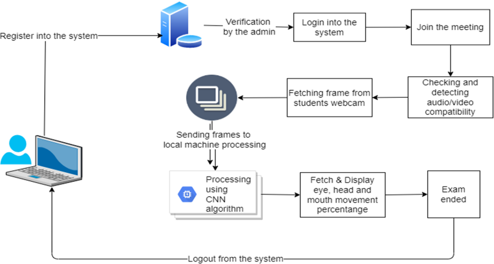
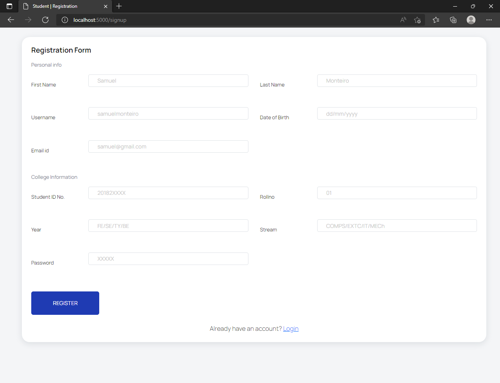
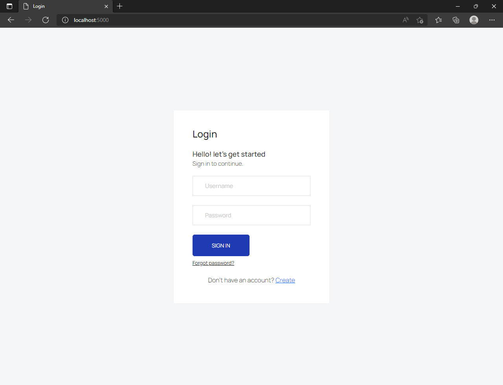
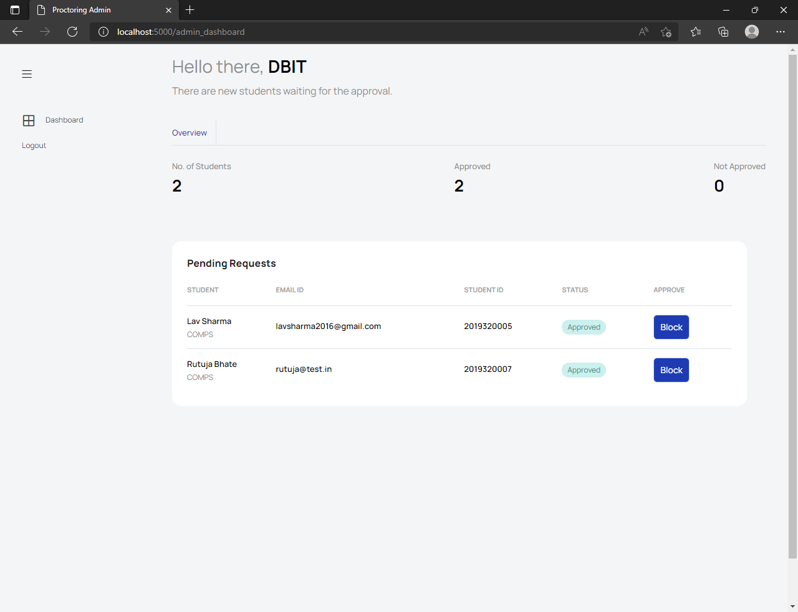
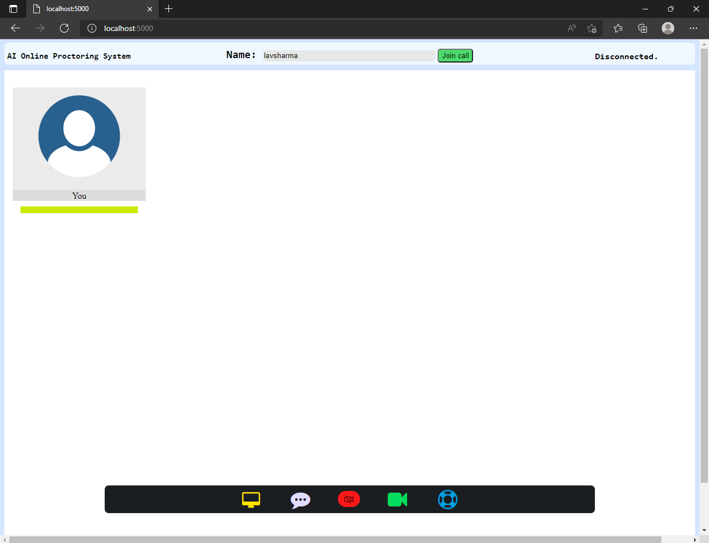
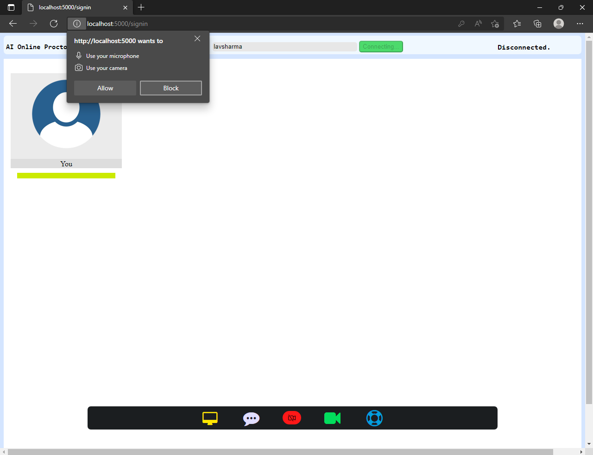
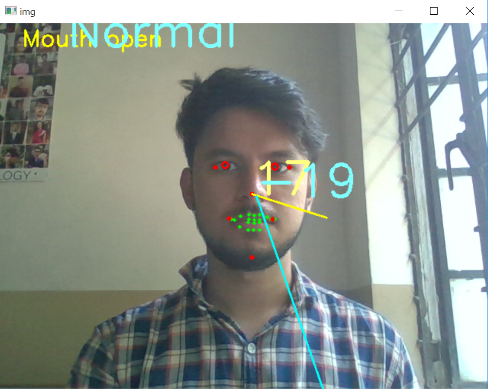

# Proc-Xam - AI Based Proctoring

The main objective of the project is to conduct honest, faithful examination by developing an AI based online proctoring system which will help teachers to check the examinee's authenticity, eliminate suspicious behavior during the exam and keep track of students throughout the exam time. In addition to that, conducting smooth and honest examinations will increase everyone’s trust in the online education sector. Proposed project is a website developed using AI algorithms Dlib CNN algorithm which monitors students during the exam, allowing students to attend the exam from any location, which will help in detecting any malicious activities via webcam and guarantee fair evaluation of exams. Vision based tracking consists of Eye ball tracking, Lip movement, and Head Tracking. The website will also ensure that the candidate is sharing his/her screen whenever asked in the exam.

### Prerequisites

For Windows
```
# create a python enviroment
python -m venv venv

# activate environment
venv\Scripts\activate

# install dependency
pip install -r requirements.txt
```

For Linux
```
# For Linux
python3 -m venv venv

# activate environment
source venv/bin/activate

# install dependency
pip install -r requirements.txt
```

Run the website by using the below command
```
python app.py
```
# open the website at 
```
localhost:5000
```

## Vision

It has three vision based functionalities right now:
1. Track eyeballs and report if candidate is looking left, right or up.
2. Find if the candidate opens his mouth by recording the distance between lips at starting.
3. Head pose estimation to find where the person is looking.

## Working
- This project is an extension of the individual modules implemented [here](https://github.com/lavsharmaa/proctoring-ai)
- For the use of twilio video call API you need to register on [Twilio](https://www.twilio.com/) and get the APIs for using the video call feature.
- It consists of the student login/register, join video call, switch on/off video and audio, chat feature and combined model running on the student face when clicked on the proctoring button.
- For now the model is working on local machine further can be hosted on cloud and no installation of individual library will be required.
- Detail video explanation can be found [here](https://drive.google.com/file/d/1_8JqK3AT2m8VMPEcB-6AZ2oRXfy7KaoK/view?usp=sharing).
- After student registration the admin needs to approve the student aaccount and then only the student will be able to login into the system.

## Images
<br>
<br>
<br>
<br>
<br>
<br>
<br>
<br>

## Contributors
- Samuel Monteiro<br> 
[](https://www.linkedin.com/in/samuel-monteiro-86103320a/)
[](https://github.com/ssBEASTss)
- Lav Sharma<br>
[](https://www.linkedin.com/in/lavsharmaa/)
[](https://github.com/lavsharmaa)
- Rutuja Bhate<br>
[](https://www.linkedin.com/in/rutuja-bhate-2a5999192/)
[](https://github.com/rutuja1908)